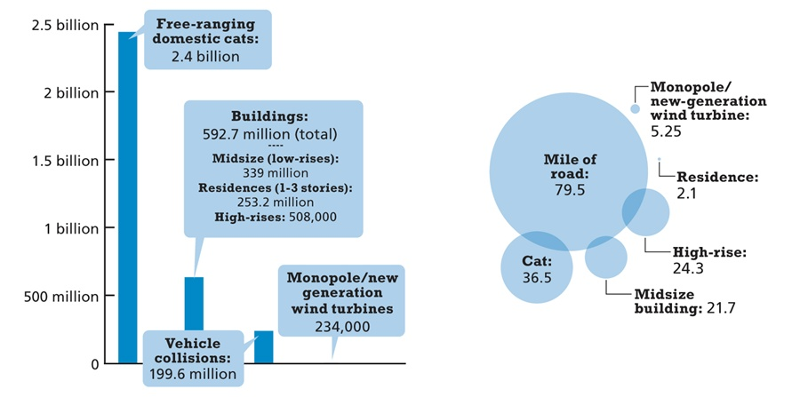
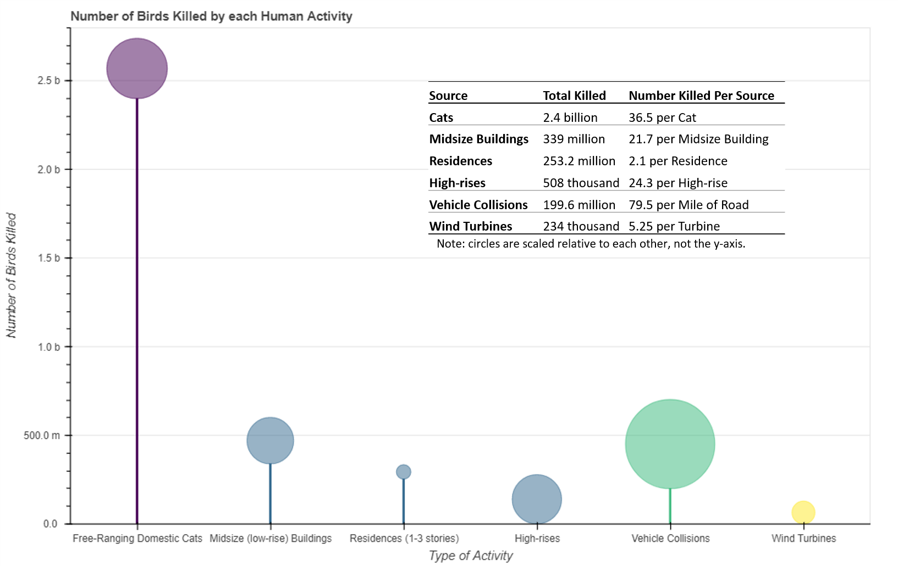

# redesign2
My teammate and I were tasked with finding and redesigning a graphic for our statistics colloquium class.

This is the original graphic that we found in an online article from the November 2014 issue of Discover Magazine.
http://discovermagazine.com/2014/nov/10-bye-bye-birdies

This is our redesigned graphic:

We accomplished this using the Bokeh plotting library and a tiny bit of Microsoft PowerPoint (for the data table). 
